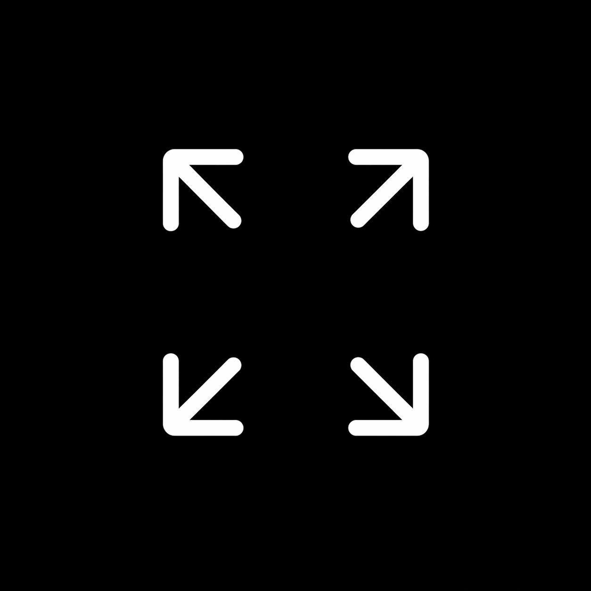

<p align="center">
  
</p>

<br/>

<h1 align="center">BlackScreen</h1>

<p align="center">
  Turn off your MacBook screen. Stay focused on your movie.
</p>

<br/>

<p align="center">
  <a href="https://github.com/ataberkcemunal/BlackScreen/releases/latest">
    
  </a>
</p>

<p align="center">
  <sub>Free • No setup • Works instantly</sub>
</p>

---

## 🎬 Why BlackScreen?

When watching movies or TV shows at night on an external monitor,  
your MacBook screen can create unwanted light and break immersion.

**BlackScreen fixes this instantly** by turning your built-in display completely black  
while keeping your external monitor fully usable.

---

## ✨ Features

- 🎬 Perfect for movies & TV shows at night  
- 🖤 Blacks out the built-in MacBook display  
- 🖥️ Keeps external monitors fully usable  
- 🌙 Eliminates distracting screen glow  
- ⚡ Lightweight native macOS app (Swift)  
- 🎬 Smooth fade-in and fade-out  
- 🧼 No Dock icon  
- 🚫 No menu bar  
- 👆 Click anywhere to exit  

---

## 🚀 Installation

1. Download **BlackScreen.dmg**  
2. Open the DMG file  
3. Drag **BlackScreen.app** into **Applications**  
4. Launch the app  

---

## ⚙️ Usage

- Open BlackScreen  
- Your MacBook display goes completely black  
- External monitor remains active  
- Click anywhere on the black screen to exit  

---

## 🛠️ Build from source

```bash
./build.sh
open BlackScreen.app

---

## 📄 License

This project is licensed under the [MIT License](LICENSE).
